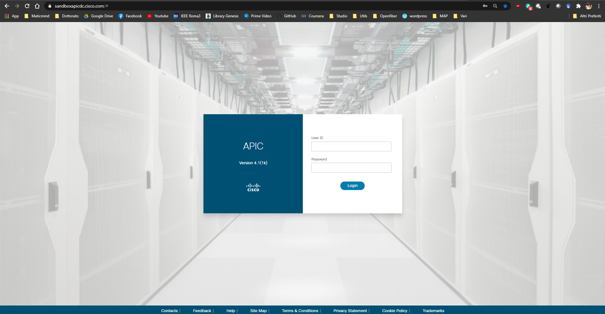
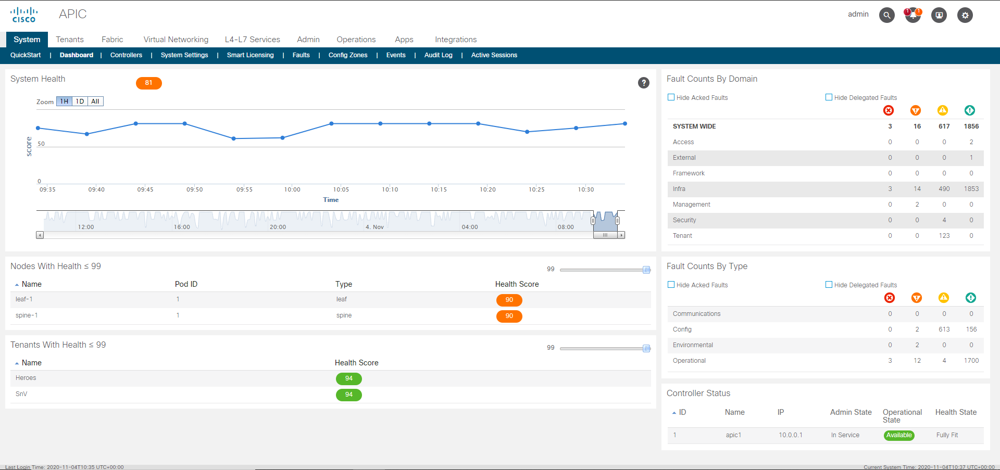

# LAB01 - Exploring APIC GUI

## Table of Contents
- [LAB01 - Exploring APIC GUI](#lab01---exploring-apic-gui)
  - [Table of Contents](#table-of-contents)
  - [Introduction](#introduction)
  - [Tasks](#tasks)
  - [Conclusions](#conclusions)

## Introduction

In this lab, you will access the Cisco APIC Sandbox and explore the APIC GUI tabs.

## Tasks

1. Open your favourite browser and go to https://sandboxapicdc.cisco.com/# or click on [this link](https://sandboxapicdc.cisco.com/#).

2. Insert the following credentials and click the **Login** button.
   - User ID: admin
   - Password: ciscopsdt

3. If your login is successful, you should see the following page, i.e. the System Dashboard of the ACI APIC:

4. Take your time to explore the other tabs in the menu bar. Please focus your attention especially on the **Tenants** and **Fabric** tabs: the major part of the configurations in the rest of this course will be executed there.

## Conclusions

In this lab you verified your connectivity to the Cisco APIC Sandbox and logged in using provided credentials. In the [next lab](../LAB2/LAB02_instructions.md) you will begin with the configuration of a Tenant on the Cisco APIC.

> :heavy_check_mark: Congratulations! You have successfully completed this lab!
