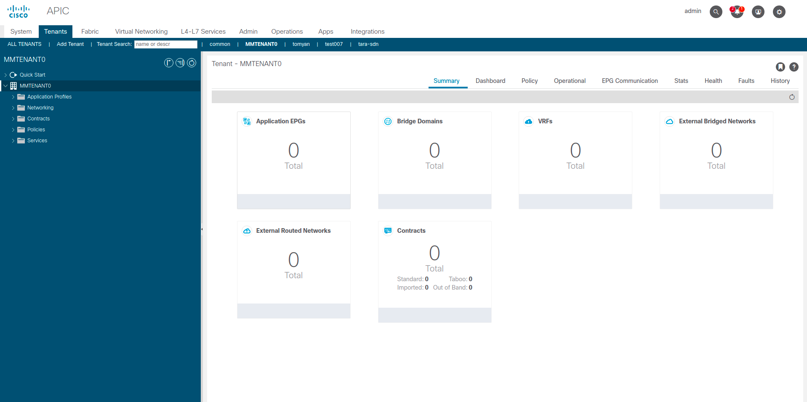
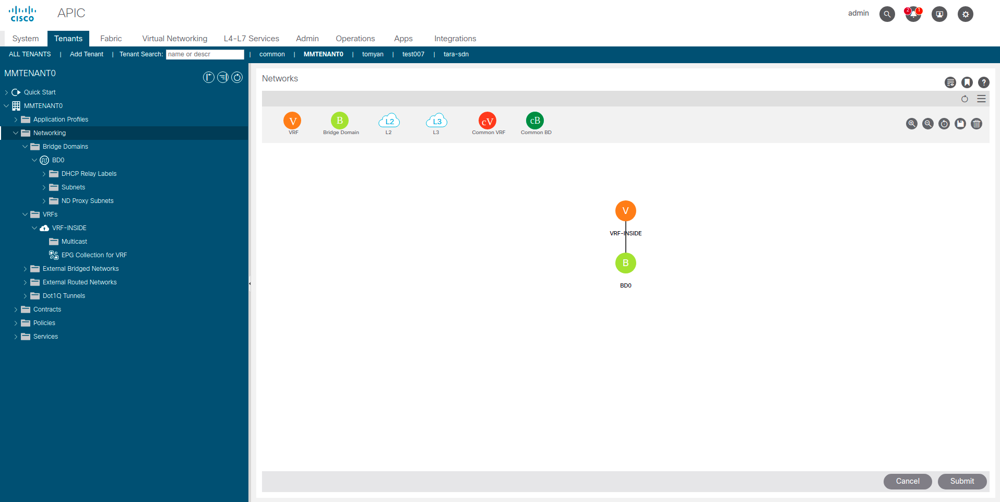

# LAB02 - Tenant, VRF and Bridge Domain

## Table of Content
- [LAB02 - Tenant, VRF and Bridge Domain](#lab02---tenant-vrf-and-bridge-domain)
  - [Table of Content](#table-of-content)
  - [Introduction](#introduction)
  - [Configuration Procedure](#configuration-procedure)
    - [ACI Tenant Creation](#aci-tenant-creation)
    - [ACI VRF & Bridge Domain Creation](#aci-vrf--bridge-domain-creation)
  - [Conclusions](#conclusions)

## Introduction

In this lab you will configure from scratch the following objects on the Cisco APIC:
- 1x Tenant
- 1x VRF
- 1x Bridge Domain

As reference, the following image reports the relationships between these three objects as they are modelled in the ACI Management Information Tree (MIT):

Inserire Figura

To perform the configuration steps reported in the following section, please access to the Cisco APIC Sandbox @ [this link](https://sandboxapicdc.cisco.com/#) using the credential below:

- User ID: admin
- Password: ciscopsdt

> :warning: When you will encounter "{*my_ID*}" remember to replace it whit the ID you were given at the beginning of this course. E.g. if you have ID = **10**, the string **MMTENANT{*my_ID*}** becomes **MMTENANT10**.

## Configuration Procedure

### ACI Tenant Creation

1. On the menu bar, click **Tenants**.
2. On the submenu bar, click **Add Tenant**.
3. In the _Create Tenant_ dialog box...
   1. Fill the **Name** field with **MMTENANT{*my_ID*}**
   2. Check the box next to "_Take me to this tenant when I click finish_" (default config)
   3. Click the **Submit** button.

Take the time to open and explore the folders that have been contained under the root of your tenant. Clicking on MMTENANT{*my_ID*} in the navigation pane you will see a summary of the configured objects under your tenant. Of course, at this moment you will see something like this, i.e. your tenant is still empty:

---

### ACI VRF & Bridge Domain Creation

1. In the navigation pane, expand **MMTENANT{*my_ID*}>Networking**
2. Right-click in **VRF** and select **Create VRF**
3. In the _Create VRF_ dialog box - _STEP1 > VRF_ tab...
   1. Fill the **Name** field with **VRF-INSIDE**
   2. Select **Enforced** next to _Policy Control Enforcement Preference_ (default config)
   3. Check the box next to _Create A Bridge Domain_
   4. Click the **Next** button.
4. In the _Create VRF_ dialog box - _STEP2 > Bridge Domain_ tab...
   1. Fill the **Name** field with **BD{*my_ID*}**
   2. Click the **Finish** button.

Now you should be able to see the newly created objects, respectively under the **Networking>VRFs** and **Networking>Bridge Domains** folders. If you click on **Networking**, you will see a graphical representation of your VRF and Bridge Domain:

---

## Conclusions

In this lab you created a tenant on the Cisco APIC and configured part of its "_networking side_", i.e. a VRF and a Bridge Domain. In the [next lab](../LAB3/LAB03_instructions.md) you will configure the "_application profile_" of your tenant.

> :heavy_check_mark: Congratulations! You have successfully completed this lab!
