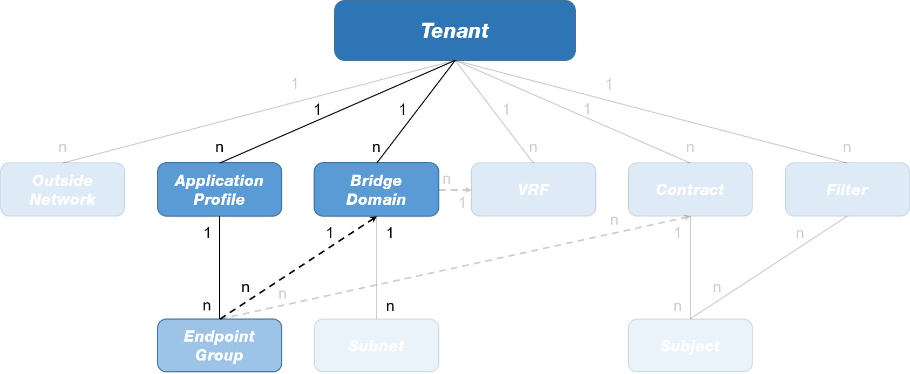
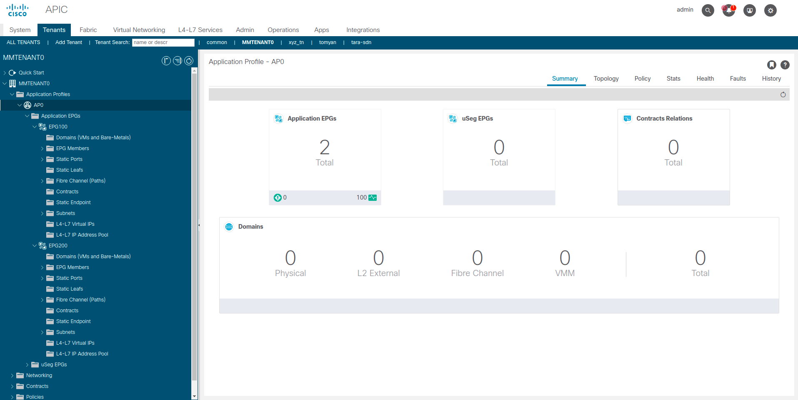

# LAB03 - Application Profile (AP) and EndPoint Group (EPG)

## Table of Contents
- [LAB03 - Application Profile (AP) and EndPoint Group (EPG)](#lab03---application-profile-(ap)-and-endpoint-group-(epg))
  - [Table of Contents](#table-of-contents)
  - [Introduction](#introduction)
  - [Configuration Procedure](#configuration-procedure)
    - [ACI Application Profile and EndPoint Groups](#aci-application-profile-and-endpoint-groups)
  - [Conclusions](#conclusions)

## Introduction

In this lab, you will configure the following objects on the Cisco APIC:
- 1x Application Profile
- 2x EndPoint Groups

They will be configured inside the tenant you created in the [previous lab](../LAB2/LAB02_instructions.md).
As reference, the following image reports the relationships between these objects as they are modelled in the ACI Management Information Tree (MIT):

---

To perform the configuration steps reported in the following section, please access to the Cisco APIC Sandbox @ [this link](https://sandboxapicdc.cisco.com/#) using the credential below:

- User ID: admin
- Password: ciscopsdt

> :warning: When you encounter "{*my_ID*}" in the configuration steps, remember to replace it with the ID you were given at the beginning of this course.
> 
> E.g. if you have ID = **10**, the string **MMTENANT{*my_ID*}** becomes **MMTENANT10**.

## Configuration Procedure

### ACI Application Profile and EndPoint Groups

1. On the menu bar, click **Tenants**.
2. Look for your tenant (**MMTENANT{*my_ID*}**) and double-click on it.
3. Right-click on **Application Profiles** and select **Create Application Profile**.
4. In the _Create Application Profile_ dialog box...
   1. Fill the **Name** field with **AP{*my_ID*}**.
   2. In the _EPGs_ section, click the "**+**" button...
      1. Fill the **Name** field with **EPG100**
      2. From the drop-down menu **BD**, select the previously created Bridge Domain **BD100**
      3. Click the **Update** button.
   3. In the _EPGs_ section, click again the "**+**" button...
      1. Fill the **Name** field with **EPG200**
      2. From the drop-down menu **BD**, select the previously created Bridge Domain **BD200**
      3. Click the **Update** button.
   4. Click the **Submit** button.

Expand and explore the subfolders of the newly created Application Profile. Clicking on the **Application Profiles>AP{*my_ID*}** you should be able to see a summary of the elements we created under this AP, i.e. the two EPGs:

---

## Conclusions

In this lab you created an Application Profile under your Tenant on the Cisco APIC. Furthermore, two EPGs have been included into it. Notice that each of the EPGs has been associated with a Bridge Domain: in this way the "_application side_" and the "_networking side_" have been linked together. In the [next lab](../LAB4/LAB04_instructions.md) you will configure a **contract** between the two EPGs so that they can communicate across the the ACI fabric.

> :heavy_check_mark: Congratulations! You have successfully completed this lab!
