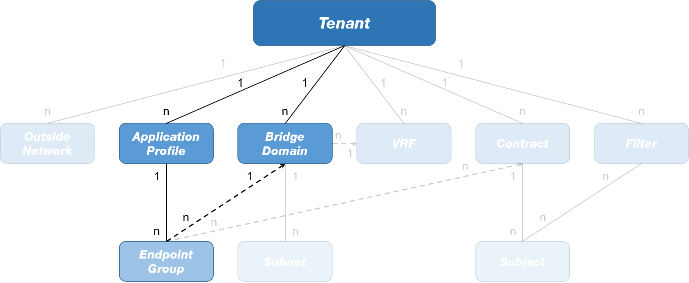

# LAB04 - ACI Contracts

## Table of Contents
- [LAB04 - ACI Contracts](#lab04---aci-contracts)
  - [Table of Contents](#table-of-contents)
  - [Introduction](#introduction)
  - [Configuration Procedure](#configuration-procedure)
    - [ACI Contract Creation](#aci-contract-creation)
    - [ACI Contract Application](#aci-contract-application)
  - [Conclusions](#conclusions)

## Introduction

In this lab, you will configure the following objects on the Cisco APIC:
- 1x Contract
- 1x Subject
- 1x Filter

The contract will applied between the EPGs created in the [previous lab](../LAB3/LAB03_instructions.md) to allow the forwarding of icmp traffic.
As reference, the following image reports the relationships between these objects as they are modelled in the ACI Management Information Tree (MIT):

To perform the configuration steps reported in the following section, please access to the Cisco APIC Sandbox @ [this link](https://sandboxapicdc.cisco.com/#) using the credential below:

- User ID: admin
- Password: ciscopsdt

> :warning: When you encounter "{*my_ID*}" in the configuration steps, remember to replace it with the ID you were given at the beginning of this course.
> 
> E.g. if you have ID = **10**, the string **MMTENANT{*my_ID*}** becomes **MMTENANT10**.

## Configuration Procedure

### ACI Contract Creation 

1. On the menu bar, click **Tenants**.
2. Look for your tenant (**MMTENANT{*my_ID*}**) and double-click on it.
3. Right-click on **Contracts** and select **Create Contract**.
4. In the _Create Contract_ dialog box...
   1. Fill the **Name** field with **permit-icmp**
   2. In the _Subjects_ section, click the "**+**" button
   3. In the _Create Contract Subject_ dialog box...
      1. Fill the **Name** field with **sub-permit-icmp**
      2. Check the box next to _Apply Both Directions_ (default config)
      3. In the _Filters_ section, click the "**+**" button
      4. From the drop-down menu **Name** click the "**+**" button in the top-right corner.
      5. In the _Create Filter_ dialog box...
         1. Fill the **Name** field with **icmp-traffic**
         2. In the _Entries_ section, click the "**+**" button...
            1. Fill the **Name** field with **icmp**
            2. From the drop-down menu **EtherType** select **IPv4**
            3. From the drop-down menu **IP Protocol** select **icmp**
            4. Click the **Update** button.
         3. Click the **Submit** button.
      6. From the drop-down menu **Action** select **Permit** (default config)
      7. Click the **Update** button.
      8. Click the **Ok** button.
   4. Click the **Submit**.

Expand the **Contracts>Standard** and the **Contracts>Filter** subfolders, you should see respectively the newly configured contract and filter. Take the time to expand and observe the created items, in particular the subject **sub-permit-icmp** under the **permit-icmp** contract.

To apply this contract between the EPGs **EPG100** and **EPG200** follow the steps in the next subsection.

### ACI Contract Application

## Conclusions

In this lab you created a contract and applied it between two EPGs to allow the icmp traffic forwarding between them. In the [next lab](../LAB5/LAB05_instructions.md) you will complete the configuration of your tenant by creating an L3Out to enable the communications between the Application EPGs and the External EPGs.

> :heavy_check_mark: Congratulations! You have successfully completed this lab!
