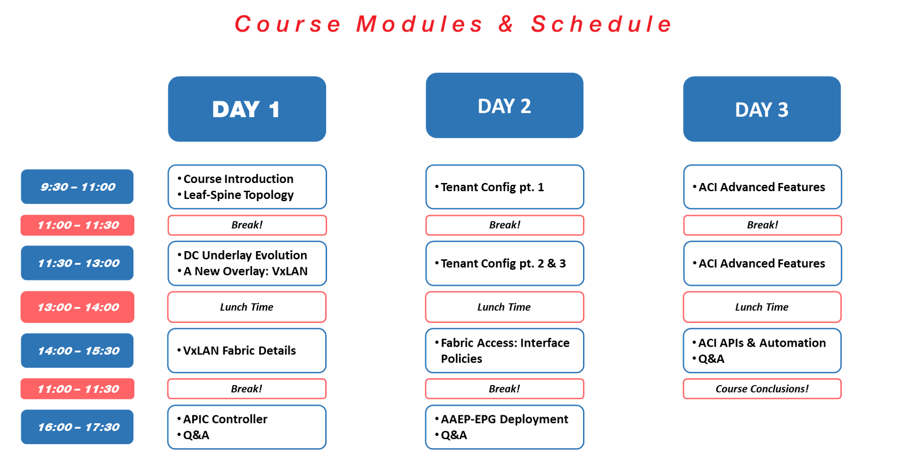

# FAIR USE NOTICE

This folder may contain copyrighted material the use of which has not always been specifically authorized by the copyright owner. We are making such material available for educational purpose on the technologies covered in this course. We believe this constitutes a fair use of any such copyrighted material as provided for in section 107 of the US Copyright Law. In accordance with Title 17 U.S.C. Section 107, the material on this site is distributed without profit to those who have expressed a prior interest in receiving the included information for research and educational purposes.
If you wish to use copyrighted material from this site for purposes of your own that go beyond fair use, you must obtain permission from the copyright owner.

---

# Course Material

- []

---

# Course Modules & Schedule

